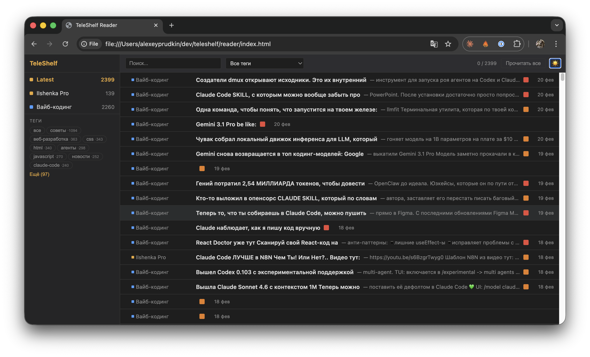

# TeleShelf

[](LICENSE)
[](https://www.python.org/)
[](https://taskfile.dev/)

Export and archive Telegram channels into a static HTML reader with tag-based navigation, dark mode, and multi-channel support.

Built on top of [tdl](https://github.com/iyear/tdl) for Telegram data export.



## Features

- **Multi-channel support** — add any number of Telegram channels, each with its own config
- **Automatic sync** — fetch new messages and media since the last export
- **Static HTML reader** — single-file reader with channel switcher, no server needed
- **Tag system** — AI-generated tags per post with sidebar filtering
- **Dark mode** — toggle between light and dark themes
- **Thread support** — export and display comment threads
- **Read tracking** — posts marked as read on expand, persisted in localStorage

## Prerequisites

| Tool | Version | Description |
|------|---------|-------------|
| [tdl](https://github.com/iyear/tdl) | 0.20+ | Telegram data export and download |
| [Task](https://taskfile.dev/) | 3.x | Task runner (like Make, but better) |
| [Python](https://www.python.org/) | 3.10+ | Reader generator script |
| [Claude Code](https://claude.ai/claude-code) | latest | *Optional.* Auto-tagging during sync |

### Install dependencies

**tdl** — follow [tdl installation guide](https://docs.iyear.me/tdl/getting-started/installation/). After install, authenticate:

```bash
tdl login
```

**[Task](https://taskfile.dev/)** (macOS / Windows):

```bash
# macOS
brew install go-task

# Windows
choco install go-task
# or
winget install Task.Task
```

**Python dependencies:**

```bash
pip install -r requirements.txt
```

**Claude Code** (optional) — if installed, `task sync` will auto-tag new posts using Claude:

```bash
npm install -g @anthropic-ai/claude-code
```

## Quick Start

```bash
# 1. Add a channel (auto-resolves IDs and slug from any Telegram post URL)
task add-channel -- "https://t.me/somechannel/42"

# 2. Sync messages and media
task sync -- somechannel

# 3. Open the reader
open reader/index.html
```

### URL formats for `add-channel`

```bash
# Public channel — slug auto-derived from username
task add-channel -- "https://t.me/username/123"

# Private channel — slug required (no username in URL)
task add-channel -- my-channel "https://t.me/c/1234567890/123"

# With comment thread auto-detection
task add-channel -- "https://t.me/username/123?comment=456"
```

## How It Works

1. **`task add-channel`** — creates a directory under `downloads/<slug>/` with a `channel.json` config. For public channels, the slug is auto-derived from the username.
2. **`task sync`** — exports new messages via `tdl`, merges them into `all-messages.json`, downloads media, optionally tags posts with AI, and rebuilds the reader.
3. **`task sync-all`** — syncs all channels in one go, builds the reader once at the end.
4. **`task build-reader`** — generates `reader/index.html` — a self-contained static page with all channels.

## Project Structure

```
TeleShelf/
  Taskfile.yml              # Automation tasks
  scripts/build_reader.py   # Static reader generator
  downloads/
    <channel-slug>/
      channel.json          # Channel config (channel_id, name, discussion_group_id)
      channel-full/
        all-messages.json   # All exported messages (sorted by ID desc)
      channel-main/         # Downloaded media files
      tags.json             # AI-generated tags per post
      threads/              # Exported comment threads
  reader/
    index.html              # Generated multi-channel reader
```

## License

MIT
